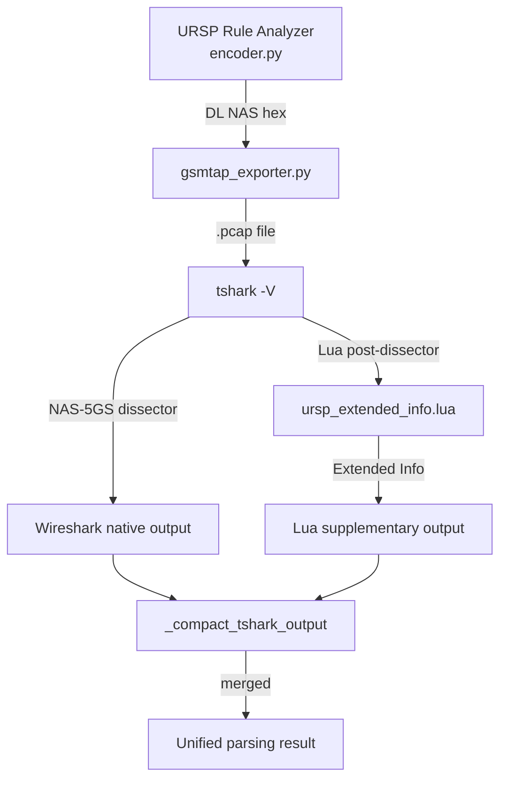
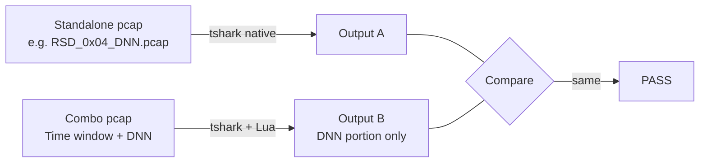
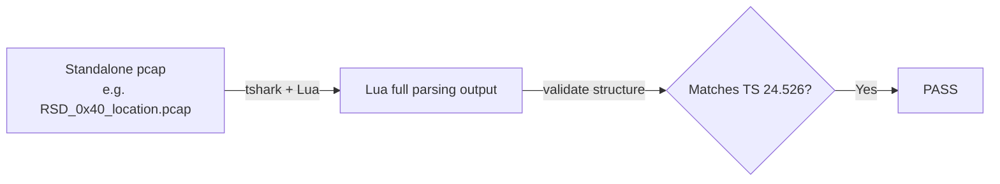

# URSP Protocol Wireshark Parsing Verification Report

## 1. Conclusion

| Metric | Wireshark Native | With Lua Plugin |
|--------|:----------------:|:---------------:|
| RSD types parsed | 8 / 13 (62%) | **13 / 13 (100%)** |
| TD types parsed | 17 / 24 (71%) | **24 / 24 (100%)** |
| Format consistency | — | 28/29 consistent |
| Known Wireshark bug | 1 (FQDN) | Corrected by Lua |

---

## 2. Lua Plugin Overview

`ursp_extended_info.lua` (v1.1.2) is a Wireshark post-dissector that supplements
the built-in NAS-5GS dissector for URSP protocol parsing.

### What it does

| Problem | Resolution |
|---------|-----------|
| "IE not dissected yet" for RSD types 0x40, 0x80, 0x82, 0x83 | Re-parse entire RSD contents block |
| "IE not dissected yet" for TD types 0x92, 0xA2, 0xA3 | Re-parse entire TD contents block |
| Unregistered type 0x84 shown as "Unknown" | Display correct name from TS 24.526 |
| OS Id/App Id shown as raw hex | Decode OS name + app category |
| Connection capabilities Rel-18 shown as "Unknown" | Display official Rel-18 names |
| Destination FQDN first character dropped | Display correct ASCII value |

### Trigger conditions

- **RSD**: Activates when `r_sel_desc_comp_type` contains 0x40, 0x80, 0x82, or 0x83
- **TD**: Activates when `traff_desc` contains 0x92, 0xA2, or 0xA3

When no trigger type is present, Wireshark handles parsing normally and the plugin
only adds supplementary interpretation (OS Id decode, Rel-18 names, FQDN correction).

---

## 3. Type-by-Type Results

### Result Categories

| Symbol | Meaning |
|:------:|---------|
| ✅ | Wireshark parses correctly. Lua produces same format when it handles this type. |
| ❌→✅ | Wireshark fails ("IE not dissected yet"). Lua parses successfully. |
| ⚠️→✅ | Wireshark shows raw/incomplete data. Lua adds human-readable interpretation. |
| ❌→⚠️ | Wireshark has a bug. Lua provides correct value (see Appendix). |

### 3.1 RSD (Route Selection Descriptor) — 13 Types

#### 3.1.1 ✅ 0x01 SSC mode — [RSD_0x01_SSC_mode.pcap](https://github.com/joostone-ahn/ursp-rule-analyzer-releases/raw/main/wireshark/pcap/RSD_0x01_SSC_mode.pcap)

```
Route selection descriptor component type identifier: SSC mode (1)
.... .001 = SSC mode: SSC mode 1 (1)
```

#### 3.1.2 ✅ 0x02 S-NSSAI — [RSD_0x02_2_S_NSSAI_SST_SD.pcap](https://github.com/joostone-ahn/ursp-rule-analyzer-releases/raw/main/wireshark/pcap/RSD_0x02_2_S_NSSAI_SST_SD.pcap)

```
Route selection descriptor component type identifier: S-NSSAI (2)
Length of Mapped S-NSSAI content: 4
Slice/service type (SST): eMBB (1)
Slice differentiator (SD): 100
```

#### 3.1.3 ✅ 0x04 DNN — [RSD_0x04_DNN.pcap](https://github.com/joostone-ahn/ursp-rule-analyzer-releases/raw/main/wireshark/pcap/RSD_0x04_DNN.pcap)

```
Route selection descriptor component type identifier: DNN (4)
Length: 9
DNN: internet
```

#### 3.1.4 ✅ 0x08 PDU session type — [RSD_0x08_PDU_session_type.pcap](https://github.com/joostone-ahn/ursp-rule-analyzer-releases/raw/main/wireshark/pcap/RSD_0x08_PDU_session_type.pcap)

```
Route selection descriptor component type identifier: PDU session type (8)
.... .001 = PDU session type: IPv4 (1)
```

#### 3.1.5 ✅ 0x10 Preferred access type — [RSD_0x10_preferred_access_type.pcap](https://github.com/joostone-ahn/ursp-rule-analyzer-releases/raw/main/wireshark/pcap/RSD_0x10_preferred_access_type.pcap)

```
Route selection descriptor component type identifier: Preferred access type (16)
.... 0... = Spare: 0
.... .0.. = Spare: 0
.... ..01 = Access type: 3GPP access (1)
```

#### 3.1.6 ✅ 0x11 Multi-access preference — [RSD_0x11_multi_access_preference.pcap](https://github.com/joostone-ahn/ursp-rule-analyzer-releases/raw/main/wireshark/pcap/RSD_0x11_multi_access_preference.pcap)

```
Route selection descriptor component type identifier: Multi-access preference (17)
```

#### 3.1.7 ✅ 0x20 Non-seamless offload — [RSD_0x20_non_seamless_offload.pcap](https://github.com/joostone-ahn/ursp-rule-analyzer-releases/raw/main/wireshark/pcap/RSD_0x20_non_seamless_offload.pcap)

```
Route selection descriptor component type identifier: Non-seamless non-3GPP offload indication (32)
```

#### 3.1.8 ❌→✅ 0x40 Location criteria — [RSD_0x40_5_location_combined.pcap](https://github.com/joostone-ahn/ursp-rule-analyzer-releases/raw/main/wireshark/pcap/RSD_0x40_5_location_combined.pcap)

Wireshark native (fails):
```
Route selection descriptor component type identifier: Location criteria type (64)
IE not dissected yet
```

Lua plugin (parses successfully — RSD_0x40_5_location_combined.pcap):
```
Route selection descriptor component type identifier: Location criteria (64)
Location criteria
    Length of location criteria: 44
    Type of location area: NR cell identities list (2)
    Number of NR cell identities: 1
    NR cell id 1
        Mobile Country Code (MCC): 450
        Mobile Network Code (MNC): 06
        NR Cell ID: 0x0000001111
    Type of location area: E-UTRA cell identities list (1)
    Number of E-UTRA cell identities: 1
    E-UTRA cell id 1
        Mobile Country Code (MCC): 450
        Mobile Network Code (MNC): 06
        E-UTRA Cell ID: 0x12345678
    Type of location area: Global RAN node identities list (3)
    Number of Global gNB identities: 1
    Global gNB id 1
        Mobile Country Code (MCC): 450
        Mobile Network Code (MNC): 06
        gNB ID: 0xaabbccdd
    Type of location area: TAI list (4)
    Length: 14
    Partial tracking area identity list 1
        0... .... = Spare: 0
        .01. .... = Type of list: list of TACs belonging to one PLMN, with consecutive TAC values (1)
        ...0 0001 = Number of elements: 2 elements
        Mobile Country Code (MCC): 450
        Mobile Network Code (MNC): 06
        TAC: 1
    Partial tracking area identity list 2
        0... .... = Spare: 0
        .00. .... = Type of list: list of TACs belonging to one PLMN, with non-consecutive TAC values (0)
        ...0 0000 = Number of elements: 1 element
        Mobile Country Code (MCC): 450
        Mobile Network Code (MNC): 06
        TAC: 16
```

#### 3.1.9 ❌→✅ 0x80 Time window — [RSD_0x80_time_window.pcap](https://github.com/joostone-ahn/ursp-rule-analyzer-releases/raw/main/wireshark/pcap/RSD_0x80_time_window.pcap)

Wireshark native (fails):
```
Route selection descriptor component type identifier: Time window type (128)
IE not dissected yet
```

Lua plugin (parses successfully):
```
Route selection descriptor component type identifier: Time window (128)
Time window
    Starttime: Dec 31, 2025 15:00:00.000000000 UTC
    Stoptime: Dec 31, 2026 14:59:59.000000000 UTC
```

#### 3.1.10 ✅ 0x81 5G ProSe relay offload — [RSD_0x81_ProSe_relay_offload.pcap](https://github.com/joostone-ahn/ursp-rule-analyzer-releases/raw/main/wireshark/pcap/RSD_0x81_ProSe_relay_offload.pcap)

```
Route selection descriptor component type identifier: 5G ProSe layer-3 UE-to-network relay offload indication (33)
```

#### 3.1.11 ❌→✅ 0x82 PDU session pair ID — [RSD_0x82_PDU_session_pair_ID.pcap](https://github.com/joostone-ahn/ursp-rule-analyzer-releases/raw/main/wireshark/pcap/RSD_0x82_PDU_session_pair_ID.pcap)

Wireshark native (fails):
```
Route selection descriptor component type identifier: PDU session pair ID type (130)
IE not dissected yet
```

Lua plugin (parses successfully):
```
Route selection descriptor component type identifier: PDU session pair ID type (130)
PDU session pair ID: 1
```

#### 3.1.12 ❌→✅ 0x83 RSN — [RSD_0x83_RSN.pcap](https://github.com/joostone-ahn/ursp-rule-analyzer-releases/raw/main/wireshark/pcap/RSD_0x83_RSN.pcap)

Wireshark native (fails):
```
Route selection descriptor component type identifier: RSN type (131)
IE not dissected yet
```

Lua plugin (parses successfully):
```
Route selection descriptor component type identifier: RSN type (131)
RSN: 0
```

#### 3.1.13 ❌→✅ 0x84 5G ProSe multi-path — [RSD_0x84_ProSe_multipath.pcap](https://github.com/joostone-ahn/ursp-rule-analyzer-releases/raw/main/wireshark/pcap/RSD_0x84_ProSe_multipath.pcap)

Wireshark native (unregistered type):
```
Route selection descriptor component type identifier: Unknown (132)
```

Lua plugin (correct name from TS 24.526):
```
Route selection descriptor component type identifier: 5G ProSe multi-path preference (132)
```

### 3.2 TD (Traffic Descriptor) — 24 Types

#### 3.2.1 ✅ 0x01 Match-all — [TD_0x01_match_all.pcap](https://github.com/joostone-ahn/ursp-rule-analyzer-releases/raw/main/wireshark/pcap/TD_0x01_match_all.pcap)

```
Traffic descriptor: Match-all type (1)
```

#### 3.2.2 ⚠️→✅ 0x08 OS Id + OS App Id — [TD_0x08_1_OS_Id_Android_ENTERPRISE.pcap](https://github.com/joostone-ahn/ursp-rule-analyzer-releases/raw/main/wireshark/pcap/TD_0x08_1_OS_Id_Android_ENTERPRISE.pcap)

Wireshark native (hex only, no interpretation):
```
Traffic descriptor: OS Id + OS App Id type (8)
OS id(UUID): 97a498e3-fc92-5c94-8986-0333d06e4e47
Length: 10
OS App id: 454e5445525052495345
```

Lua plugin (adds OS name and category interpretation):
```
Traffic descriptor: OS Id + OS App Id type (8)
OS id(UUID): 97a498e3-fc92-5c94-8986-0333d06e4e47
    OS: Android
Length: 10
OS App id: 454e5445525052495345
    Slice Category: ENTERPRISE
```

#### 3.2.3 ✅ 0x10 IPv4 remote address — [TD_0x10_IPv4_remote_address.pcap](https://github.com/joostone-ahn/ursp-rule-analyzer-releases/raw/main/wireshark/pcap/TD_0x10_IPv4_remote_address.pcap)

```
Traffic descriptor: IPv4 remote address type (16)
IPv4 address: 192.168.1.1
IPv4 mask: 255.255.255.0
```

#### 3.2.4 ✅ 0x21 IPv6 remote address — [TD_0x21_IPv6_remote_address.pcap](https://github.com/joostone-ahn/ursp-rule-analyzer-releases/raw/main/wireshark/pcap/TD_0x21_IPv6_remote_address.pcap)

```
Traffic descriptor: IPv6 remote address/prefix length type (33)
IPv6 address: 2001:db8::1
IPv6 prefix length: 64
```

#### 3.2.5 ✅ 0x30 Protocol identifier — [TD_0x30_protocol_id.pcap](https://github.com/joostone-ahn/ursp-rule-analyzer-releases/raw/main/wireshark/pcap/TD_0x30_protocol_id.pcap)

```
Traffic descriptor: Protocol identifier/next header type (48)
Protocol identifier/next header type: TCP (6)
```

#### 3.2.6 ✅ 0x50 Single remote port — [TD_0x50_single_remote_port.pcap](https://github.com/joostone-ahn/ursp-rule-analyzer-releases/raw/main/wireshark/pcap/TD_0x50_single_remote_port.pcap)

```
Traffic descriptor: Single remote port type (80)
Remote port: 443
```

#### 3.2.7 ✅ 0x51 Remote port range — [TD_0x51_remote_port_range.pcap](https://github.com/joostone-ahn/ursp-rule-analyzer-releases/raw/main/wireshark/pcap/TD_0x51_remote_port_range.pcap)

```
Traffic descriptor: Remote port range type (81)
Remote port range low: 8000
Remote port range high: 8080
```

#### 3.2.8 ✅ 0x52 IP 3 tuple — [TD_0x52_3_IPv4_proto_port.pcap](https://github.com/joostone-ahn/ursp-rule-analyzer-releases/raw/main/wireshark/pcap/TD_0x52_3_IPv4_proto_port.pcap)

```
Traffic descriptor: IP 3 tuple type (82)
IP 3 tuple bitmap: 0x0d
IPv4 address: 10.0.0.1
IPv4 mask: 255.255.255.0
Protocol identifier/next header type: TCP (6)
Remote port: 8080
```

#### 3.2.9 ✅ 0x60 Security parameter index — [TD_0x60_SPI.pcap](https://github.com/joostone-ahn/ursp-rule-analyzer-releases/raw/main/wireshark/pcap/TD_0x60_SPI.pcap)

```
Traffic descriptor: Security parameter index type (96)
Security parameter index: 0x12345678
```

#### 3.2.10 ✅ 0x70 ToS/traffic class — [TD_0x70_ToS_traffic_class.pcap](https://github.com/joostone-ahn/ursp-rule-analyzer-releases/raw/main/wireshark/pcap/TD_0x70_ToS_traffic_class.pcap)

```
Traffic descriptor: Type of service/traffic class type (112)
Type of service/traffic class: 0xb8
Type of service/traffic class mask: 0xfc
```

#### 3.2.11 ✅ 0x80 Flow label — [TD_0x80_flow_label.pcap](https://github.com/joostone-ahn/ursp-rule-analyzer-releases/raw/main/wireshark/pcap/TD_0x80_flow_label.pcap)

```
Traffic descriptor: Flow label type (128)
.... 0001 0010 0011 0100 0101 = Flow label: 0x12345
```

#### 3.2.12 ✅ 0x81 Destination MAC — [TD_0x81_dest_MAC.pcap](https://github.com/joostone-ahn/ursp-rule-analyzer-releases/raw/main/wireshark/pcap/TD_0x81_dest_MAC.pcap)

```
Traffic descriptor: Destination MAC address type (129)
Destination MAC address: aa:bb:cc:dd:ee:ff (aa:bb:cc:dd:ee:ff)
```

#### 3.2.13 ✅ 0x83–0x86 802.1Q VLAN tags

[TD_0x83_CTAG_VID.pcap](https://github.com/joostone-ahn/ursp-rule-analyzer-releases/raw/main/wireshark/pcap/TD_0x83_CTAG_VID.pcap) / [TD_0x85_CTAG_PCP_DEI.pcap](pcap/TD_0x85_CTAG_PCP_DEI.pcap)

```
.... 0000 0110 0100 = 802.1Q C-TAG VID: 0x064
.... 011. = 802.1Q C-TAG PCP: 0x3
.... ...1 = 802.1Q C-TAG DEI: 0x1
```

#### 3.2.14 ✅ 0x87 Ethertype — [TD_0x87_ethertype.pcap](https://github.com/joostone-ahn/ursp-rule-analyzer-releases/raw/main/wireshark/pcap/TD_0x87_ethertype.pcap)

```
Traffic descriptor: Ethertype type (135)
Ethertype: IPv4 (0x0800)
```

#### 3.2.15 ✅ 0x88 DNN — [TD_0x88_DNN.pcap](https://github.com/joostone-ahn/ursp-rule-analyzer-releases/raw/main/wireshark/pcap/TD_0x88_DNN.pcap)

```
Traffic descriptor: DNN type (136)
Length: 9
DNN: internet
```

#### 3.2.16 ⚠️→✅ 0x90 Connection capabilities — [TD_0x90_2_connection_capabilities_multi.pcap](https://github.com/joostone-ahn/ursp-rule-analyzer-releases/raw/main/wireshark/pcap/TD_0x90_2_connection_capabilities_multi.pcap)

Wireshark native (Rel-18 values shown as "Unknown"):
```
Traffic descriptor: Connection capabilities type (144)
Connection capabilities length: 3
Connection capability: IMS (0x01)
Connection capability: Internet (0x08)
Connection capability: Unknown (0xa1)
```

Lua plugin (displays official Rel-18 name):
```
Traffic descriptor: Connection capabilities type (144)
Connection capabilities length: 3
Connection capability: IMS (0x01)
Connection capability: Internet (0x08)
Connection capability: IoT delay-tolerant (0xa1)
```

#### 3.2.17 ❌→⚠️ 0x91 Destination FQDN — [TD_0x91_dest_FQDN.pcap](https://github.com/joostone-ahn/ursp-rule-analyzer-releases/raw/main/wireshark/pcap/TD_0x91_dest_FQDN.pcap)

Wireshark native (bug — first character dropped):
```
Traffic descriptor: Destination FQDN (145)
Destination FQDN length: 11
Destination FQDN: xample.com
```

Lua plugin (correct value):
```
Traffic descriptor: Destination FQDN (145)
Destination FQDN length: 11
Destination FQDN: example.com
```

**Bug analysis:**

Encoded hex:
```
91 0B 65 78 61 6D 70 6C 65 2E 63 6F 6D
│  │  └─────────────────────────────────── "example.com" (plain ASCII)
│  └─ Length: 11 bytes
└─ Type: Destination FQDN (0x91)
```

- 3GPP TS 24.526 Section 5.2: FQDN value is a plain character string
- Our encoding: `0x65 0x78 0x61...` = ASCII `e x a m p l e . c o m` ✅
- Wireshark uses `ENC_APN_STR` (RFC 1035 DNS label encoding)
- First byte `0x65` ('e' = 101) misinterpreted as label length → skipped
- Result: `xample.com` (first character dropped)

#### 3.2.18 ❌→✅ 0x92 Regular expression — [TD_0x92_regex.pcap](https://github.com/joostone-ahn/ursp-rule-analyzer-releases/raw/main/wireshark/pcap/TD_0x92_regex.pcap)

Wireshark native (fails):
```
Traffic descriptor: Regular expression (146)
IE not dissected yet
```

Lua plugin (parses successfully):
```
Traffic descriptor: Regular expression (146)
Length: 16
Regular expression: .*\.example\.com
```

#### 3.2.19 ⚠️→✅ 0xA0 OS App Id — [TD_0xA0_OS_App_Id.pcap](https://github.com/joostone-ahn/ursp-rule-analyzer-releases/raw/main/wireshark/pcap/TD_0xA0_OS_App_Id.pcap)

Wireshark native (hex only):
```
Traffic descriptor: OS App Id type (160)
Length: 15
OS App id: 636f6d2e6578616d706c652e617070
```

Lua plugin (adds ASCII conversion):
```
Traffic descriptor: OS App Id type (160)
Length: 15
OS App id: 636f6d2e6578616d706c652e617070
    OS App Id (ASCII): com.example.app
```

#### 3.2.20 ✅ 0xA1 Destination MAC range — [TD_0xA1_dest_MAC_range.pcap](https://github.com/joostone-ahn/ursp-rule-analyzer-releases/raw/main/wireshark/pcap/TD_0xA1_dest_MAC_range.pcap)

```
Traffic descriptor: Destination MAC address range type (161)
Destination MAC address range low: aa:bb:cc:dd:ee:00 (aa:bb:cc:dd:ee:00)
Destination MAC address range high: aa:bb:cc:dd:ee:ff (aa:bb:cc:dd:ee:ff)
```

#### 3.2.21 ❌→✅ 0xA2 PIN ID — [TD_0xA2_PIN_ID.pcap](https://github.com/joostone-ahn/ursp-rule-analyzer-releases/raw/main/wireshark/pcap/TD_0xA2_PIN_ID.pcap)

Wireshark native (unregistered type, fails):
```
Traffic descriptor: Unknown (162)
IE not dissected yet
```

Lua plugin (parses successfully):
```
Traffic descriptor: PIN ID type (162)
Length: 7
PIN ID: pin-001
```

#### 3.2.22 ❌→✅ 0xA3 Connectivity group ID — [TD_0xA3_connectivity_group_ID.pcap](https://github.com/joostone-ahn/ursp-rule-analyzer-releases/raw/main/wireshark/pcap/TD_0xA3_connectivity_group_ID.pcap)

Wireshark native (unregistered type, fails):
```
Traffic descriptor: Unknown (163)
IE not dissected yet
```

Lua plugin (parses successfully):
```
Traffic descriptor: Connectivity group ID type (163)
Length: 8
Connectivity group ID: group-01
```

### 3.3 Multi-Component Combo Examples

When a trigger type (0x40/0x80/0x92) appears in a block, Wireshark abandons parsing
of ALL subsequent components. The Lua plugin re-parses the entire block.

#### Location criteria + S-NSSAI + DNN

Wireshark native:
```
Route selection descriptor contents
    Route selection descriptor component type identifier: Location criteria type (64)
    IE not dissected yet
```

Lua plugin:
```
Route selection descriptor contents
    Route selection descriptor component type identifier: Location criteria (64)
    Location criteria
        Length of location criteria: 19
        Type of location area: NR cell identities list (2)
        Number of NR cell identities: 1
        NR cell id 1
            Mobile Country Code (MCC): 450
            Mobile Network Code (MNC): 06
            NR Cell ID: 0x1111111111
    Route selection descriptor component type identifier: S-NSSAI (2)
    Length of Mapped S-NSSAI content: 4
    Slice/service type (SST): eMBB (1)
    Slice differentiator (SD): 100
    Route selection descriptor component type identifier: DNN (4)
    Length: 9
    DNN: internet
```

#### Regular expression + DNN + Single remote port

Wireshark native:
```
Traffic descriptor
    Traffic descriptor: Regular expression (146)
    IE not dissected yet
```

Lua plugin:
```
Traffic descriptor
    Traffic descriptor: Regular expression (146)
    Length: 6
    Regular expression: .*test
    Traffic descriptor: DNN type (136)
    Length: 9
    DNN: internet
    Traffic descriptor: Single remote port type (80)
    Remote port: 443
```

---

## 4. Verification Method

### 4.1 E2E Processing Flow



1. **Encoder** generates DL NAS Transport hex from structured URSP rule data
2. **gsmtap_exporter** wraps hex into Exported PDU pcap format
3. **tshark** loads pcap and runs NAS-5GS dissector (native parsing)
4. **Lua plugin** runs as post-dissector, detects failures, re-parses affected blocks
5. **_compact_tshark_output** merges native + Lua output into single unified result

### 4.2 Verification Approach

**For ✅ types (Wireshark parses natively):**



1. Standalone pcap → Wireshark parses natively → extract output (Output A)
2. Combo pcap (same type after trigger) → Lua parses → extract same type portion (Output B)
3. Compare A vs B line-by-line → must produce same format

**For ❌ types (Wireshark fails):**



1. Standalone pcap → Lua triggers full re-parsing
2. Validate output structure against 3GPP TS 24.526 field definitions

### 4.3 Tools

- Script: [`test/verify_lua_parsing.py`](test/verify_lua_parsing.py)
- Pcaps: [`pcap/`](pcap/) (53 files)
- Automated result: 34 PASS / 0 FAIL / 4 WARN (standalone-only types)

### 4.4 Environment

- Wireshark: TShark 4.6.5 (macOS)
- Lua plugin: `ursp_extended_info.lua` v1.1.2
